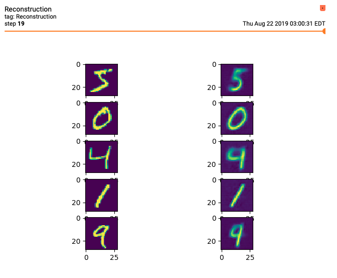
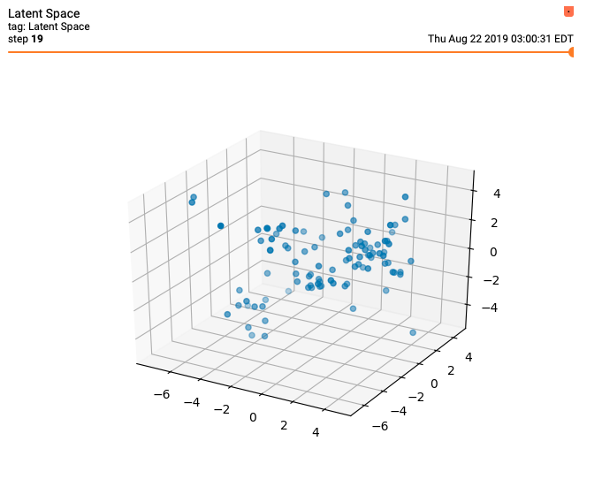

# DAZE

## Autoencoders and GANs

Daze is a library for Autoencoders and Generative Adversarial Networks. It includes implementations of a number of popular algorithms - and is designed to make it easy to research and develop new techniques.

## Installation
```bash
git clone https://github.com/jakegrigsby/daze.git
cd daze
make user
```


## Getting Started :beginner:
Daze includes a number of popular datasets and algorithms out-of-the-box. Here's a short script that trains a Denoising Autoencoder on MNIST.

```python
import daze as dz
from daze.callbacks import *
from daze.data.utils import convert_np_to_tf

train, val = dz.data.mnist.load(dtype="f32")
train, val = train/255., val/255.

encoder = dz.nets.encoders.ConvolutionalEncoder(latent_dim=3)
decoder = dz.nets.decoders.MnistDecoder()
model = dz.recipes.DenoisingAutoEncoder(encoder, decoder)

callbacks = [checkpoints(1), tensorboard_loss_scalars(), tensorboard_latent_space_plot(train[:100]), tensorboard_image_reconstruction(train[:5])]

train_tf, val_tf = convert_np_to_tf(train, batch_size=32), convert_np_to_tf(val, batch_size=32)
model.train(train_tf, val_tf, epochs=20, verbosity=2, callbacks=callbacks)
```
This script runs 20 epochs of training, saving weights along the way. It also generates diagrams like these - showing the quality of the reconstruction at the end of each epoch.



Because the latent dimension size was <= 3, the `tensorboard_latent_space_plot` callback drew this diagram:



The `recipes` module includes implementations of:

| Name | Paper |
| --- | :---: | 
|Autoencoder| [Baldi](https://dl.acm.org/citation.cfm?id=3045801) |
|GAN| [Goodfellow et al.](https://papers.nips.cc/paper/5423-generative-adversarial-nets.pdf)
|Contractive AE | [Rifai et al.](http://www.icml-2011.org/papers/455_icmlpaper.pdf)
|Denoising AE| [Vincent et al.](https://www.cs.toronto.edu/~larocheh/publications/icml-2008-denoising-autoencoders.pdf)
|Sparse AE| [Ng](https://web.stanford.edu/class/cs294a/sparseAutoencoder.pdf)
|VAE| [Kingma, Welling](https://arxiv.org/abs/1312.6114)
|BetaVAE| [Higgins et al.](https://openreview.net/references/pdf?id=Sy2fzU9gl)
|InfoVAE|[Zhao et al.](https://arxiv.org/abs/1706.02262)

## Mix and Match Components
It's easy to mix and match components of each algorithm. There are five main categories of 'pieces':

1) __Preprocessing Functions__:
A modification to the input tensor before each training iteration. Used in Denoising Autoencoders and in image augmentation pipelines. These are found in `preprocessing.py`
2) __Foward Passes__:
The model's computation graph - how it maps inputs to outputs. For example, autoencoders perform a straightforward NN inference pass while VAEs create a distribution from the latent vector and sample from it. These are found in `forward_pass.py`
3) __Loss Functions__:
The cost function(s) to minimize. These are found in   `loss.py`. Their compatability with the rest of the algorithm depends on the forward pass being used, but `daze` includes a type checking system that should help.
4) __Encoders__:
The encoder neural network model. We've included a few in the `nets.encoders` module, with more coming soon.
5) __Decoders__:
The decoder neural network model. We've included a few in the `nets.decoders` module, with more coming soon.

The general format for swapping pieces is:

(_AutoEncoders_)
```python
import daze as dz

my_custom_autoencoder = dz.AutoEncoder(encoder=dz.nets.encoders.ConvolutionalEncoder(),
                decoder=dz.nets.decoders.MnistDecoder(),
                preprocessing_steps=[dz.preprocessing.basic_image_normalize(), dz.preprocessing.random_mask(.1)],
                loss_funcs=[dz.loss.reconstruction(), dz.loss.denoising_reconstruction()],
                forward_pass_func=dz.forward_pass.standard_encode_decode())
```

(_GANs_)
```python
import daze as dz

my_custom_gan = dz.GAN(generator=dz.nets.decoders.MnistDecoder(),
    discriminator=dz.nets.encoders.ConvolutionalEncoder(),
    noise_dim=100,
    preprocessing_steps=[dz.preprocessing.gaussian_noise(.1, 0, 1.)],
    forward_pass_func=dz.forward_pass.generative_adversarial(),
    generator_loss=[dz.loss.feature_matching()],
    discriminator_loss=[dz.loss.one_sided_label_smoothing()]
)
```
For more examples, see the `recipes` module.

:warning: Not every component combination is compatible with each other. They are given relatively long, literature-standard names to decrease confusion, but you may still run into trouble if you're not familiar with these algorithms. Luckily, there is a type checking system that should tell you when you get it wrong. :warning:

## Creating Custom Components
Completely custom components can be added by writing them in the same format as existing examples (see `loss.py`, `forward_pass.py`, `preprocessing.py`). There are a couple things to be aware of. Here's an example for reference:
```python
def sparsity(rho, beta):
    """Sparsity loss term.

    Args:
        rho (float) : the target sparsity value (~.01)
        beta (float) : coefficient for this terms' contribution to the overall loss function.
    """
    rho = tf.constant(rho)

    @trace_graph
    @ae_compatible
    def _sparsity(**forward_pass):
        h = forward_pass["h"]
        rho_hat = tf.reduce_mean(h, axis=0)
        return beta * tf.keras.losses.kld(rho, rho_hat)

    return _sparsity
```
1) The Models expect components to be functions. However, many components need some sort of argument, like the `rho` and `beta` terms above. We get around this using inner functions and closures. Basically, the public function takes the params you need, and returns an inner function that can use those values. For consistency's sake, our implementations do this whether they need to or not. But you could just as easily write a function that takes a `**forward_pass` arg and pass that straight into the Model.
2) Use of `@dz.tracing.trace_graph`. This is a decorator that is functionally similar to `@tf.function`, but is able to warn you about frequent retraces - a common bug that makes you better off not compiling the graph. Basically, write the function as you would normally, add the `@trace_graph` decorator, and it'll give you more information if you messed something up.
3) Compatability decorators. You'll see these all over the source code. They're from `dz.enforce` and they're meant to help the Models verify that the forward passes calculate everything the loss function needs. Basically, pick one of `@ae_compatible`, `@vae_compatible` or `@gan_compatible` (depending on what you're doing) and add that on the next line __after__ `@trace_graph`


(_More extensive documentation coming soon..._)